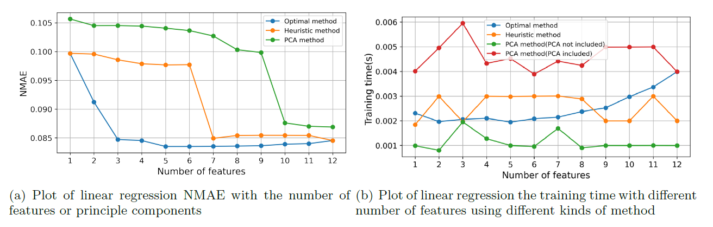
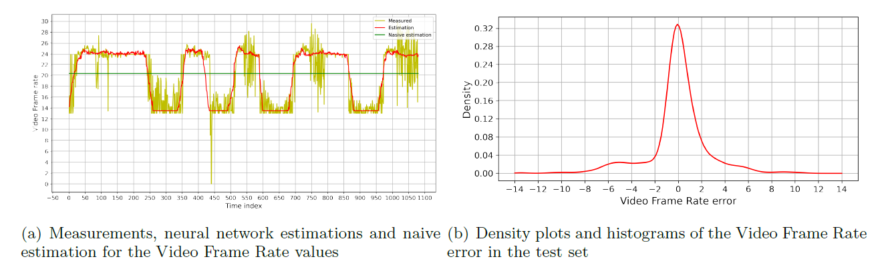

## Info

This is the first basic project repository for the course EP2420 Network Analytics at KTH. The full report can be found in the [report](https://github.com/cylead/dimensionality-reduction-on-networked-system/blob/main/report.pdf).
Tools: Python, related packages: Numpy, SciPy, Matplotlib, Scikit-
learn, Pandas, TensorFlow, Keras.

## Content

In this project, we try to solve a supervised learning problem related to video-on-demand network services. We perform data exploration, data pre-processing, feature selection, and extraction and then use a linear regression model and neural network to estimate the service metrics. The prediction result of the neural network is better than the linear regression model, but its disadvantage lies in the huge amount of computation and the complicated parameter tuning process.

## Some results

The prediction NMAE of the linear regression with the different number of input features.:

The pridiction of neural network：

